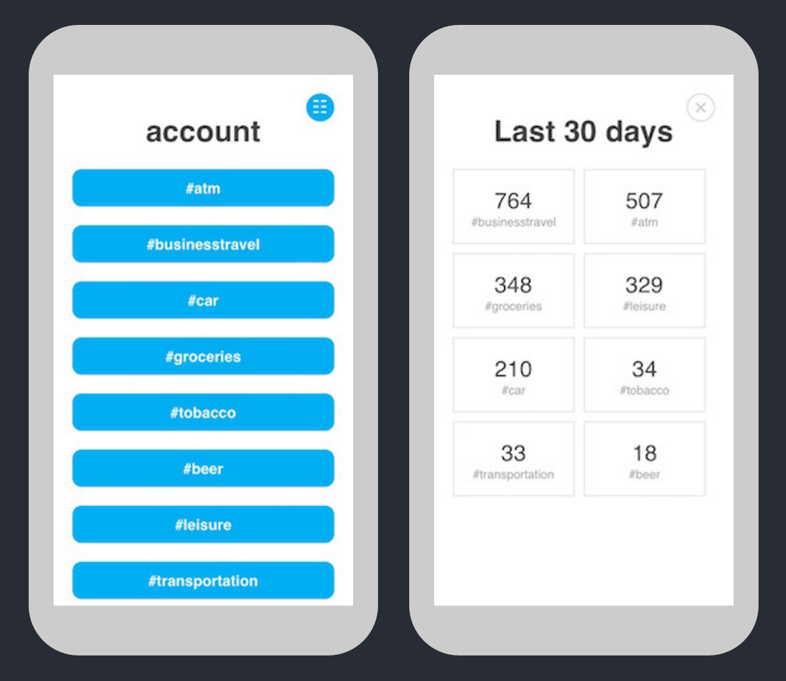

# Google Firebase Finance App
This small web-app uses Google's Firebase API.

Keep track of your monthly average expenses by entering each
expense you made, i.e. 5 EUR for a beer you just paid.

Point your smartphone to http://beer-count.sebastian-misch.de
and add it to your home-screen (iOS) or bookmark it on Android.



## Develope!

### Setup
Install dependencies.
```
$ npm install
```

### Start
Start a hot-reloading server on http://127.0.0.1:9000.
```
$ npm start
```

### Deploy
I use this to auto-deploy via Travis-CI. Feel free to use it on
your server.
```
$ npm run deploy
```
